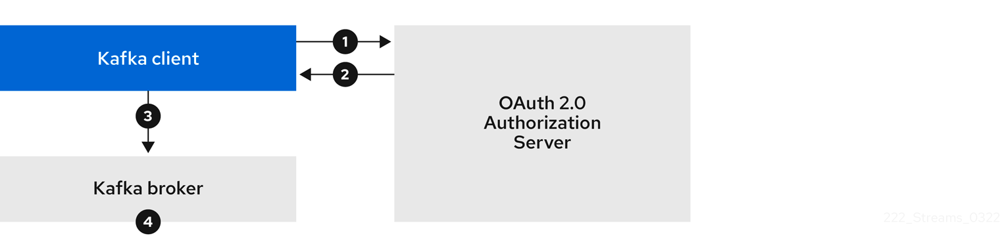
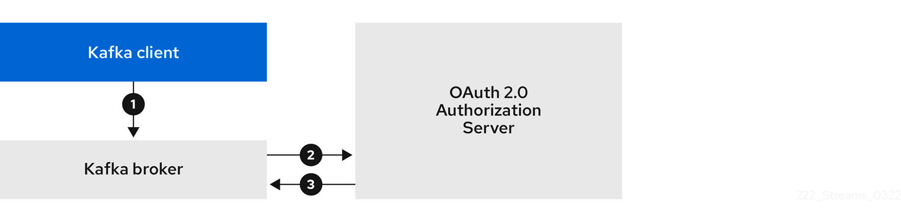
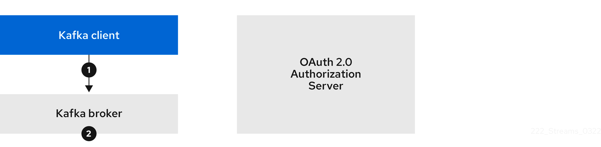

```bash
# Start a k8s cluster with 1 agent node, 1 server node (control-plane), we disable the loadbalancer in front of the server nodes
$ k3d cluster create my-k8s-cluster --agents 1 --no-lb
# view our k8s cluster 
$ k3d cluster list
# kubectl is automatically will be set to the context
$ kubectl cluster-info
# verify that we have 1 agent nodes and 1 server node
$ kubectl get nodes -o wide
# check with docker that the nodes are running in a docker container
$ docker ps
# taint the server node that no workloads are scheduled on it
$ kubectl taint nodes k3d-my-k8s-cluster-server-0 key1=value1:NoSchedule
```

After creating the cluster automatically we should switch to the created `k3d-my-k8s-cluster` context.

```bash
$ kubectl config get-contexts
CURRENT   NAME                 CLUSTER              AUTHINFO                   NAMESPACE
*         k3d-my-k8s-cluster   k3d-my-k8s-cluster   admin@k3d-my-k8s-cluster
```

Let's create a `kafka` namespaces for our playground and set permanently save the namespace for all subsequent `kubectl`
commands in that context.

```bash
$ kubectl create ns kafka
$ kubectl config set-context --current --namespace=kafka 
```

If we retrieve the current context again the kafka namespace should be set

```bash
$ kubectl config get-contexts
CURRENT   NAME                 CLUSTER              AUTHINFO                   NAMESPACE
*         k3d-my-k8s-cluster   k3d-my-k8s-cluster   admin@k3d-my-k8s-cluster   kafka
```

### Install Keycloak

```bash
$ helm install keycloak codecentric/keycloakx --values ./values.yaml
export POD_NAME=$(kubectl get pods --namespace kafka -l "app.kubernetes.io/name=keycloakx,app.kubernetes.io/instance=keycloak" -o name)
echo "Visit http://127.0.0.1:8080 to use your application"
kubectl --namespace kafka port-forward "$POD_NAME" 8080
```

### Install Strimzi

In this `strimzi.yaml` file the `STRIMZI_FEATURE_GATES` was configured to `-UseStrimziPodSets`

```bash
$ kubectl create -f strimzi.yaml
```


### Create the `broker-oauth-secret` secret

```bash
export KAFKA_BROKER_CLIENT_SECRET=zZLTLWwGYIxTzVkEekCb77YNwLpY70sY
kubectl delete secret broker-oauth-secret
kubectl create secret generic broker-oauth-secret --from-literal=secret=$KAFKA_BROKER_CLIENT_SECRET 
```

### Install a Kafka cluster

```bash
$ kubectl apply -f kafka-oauth.yaml
```

### Producer / Consumer with 9092 - this should still work

In one terminal create a producer: (this will start up the `kafka-producer` pod)

```bash
$ kubectl -n kafka run kafka-producer -ti --image=quay.io/strimzi/kafka:0.32.0-kafka-3.3.1 --rm=true --restart=Never -- bin/kafka-console-producer.sh --bootstrap-server my-cluster-kafka-bootstrap:9092 --topic my-topic
```

In one another terminal create a consumer: (this will start up a `kafka-consumer` pod)

```bash
$ kubectl -n kafka run kafka-consumer -ti --image=quay.io/strimzi/kafka:0.32.0-kafka-3.3.1 --rm=true --restart=Never -- bin/kafka-console-consumer.sh --bootstrap-server my-cluster-kafka-bootstrap:9092 --topic my-topic --from-beginning
```

### Producer / Consumer with 9093

```bash
$ kubectl -n kafka run kafka-producer -it \
--image=quay.io/strimzi/kafka:0.32.0-kafka-3.3.1 \
--rm=true --restart=Never \
-- bin/kafka-console-producer.sh --bootstrap-server my-cluster-kafka-bootstrap:9093 --topic my-topic


error: Bootstrap broker my-cluster-kafka-bootstrap:9093 (id: -1 rack: null) disconnected (org.apache.kafka.clients.NetworkClient)

```

On the broker side you will see:

```bash
2022-11-23 20:29:45,061 INFO [SocketServer listenerType=ZK_BROKER, nodeId=0] Failed authentication with /10.42.1.38 (channelId=10.42.1.34:9093-10.42.1.38:43546-4) (SSL handshake failed) (org.apache.kafka.common.network.Selector) [data-plane-kafka-network-thread-0-ListenerName(TLS-9093)-SASL_SSL-8]
```

```bash
$ kubectl -n kafka run kafka-producer -it \
--image=quay.io/strimzi/kafka:0.32.0-kafka-3.3.1 \
--rm=true --restart=Never \
-- bin/kafka-console-producer.sh --bootstrap-server my-cluster-kafka-bootstrap:9093 --topic my-topic --producer-property 'security.protocol=SSL'


[2022-11-23 20:33:45,317] ERROR [Producer clientId=console-producer] Connection to node -1 (my-cluster-kafka-bootstrap/10.43.44.73:9093) failed authentication due to: SSL handshake failed (org.apache.kafka.clients.NetworkClient)
```

### Extract the `ca.p12` from the Cluster CA secret

```bash
$ kubectl get secret my-cluster-cluster-ca-cert -n kafka -o jsonpath='{.data.ca\.p12}' | base64 -d > ca.p12
$ kubectl get secret my-cluster-cluster-ca-cert -n kafka -o jsonpath='{.data.ca\.password}' | base64 -d > ca.password
```

### Run an interactive pod:

```bash
$ kubectl run --restart=Never --image=quay.io/strimzi/kafka:0.32.0-kafka-3.3.1 producer-consumer -n kafka -- /bin/sh -c "sleep 7200"
```

### Copy the ca.p12 and config file into it.

```bash
$ kubectl cp ca.p12 producer-consumer:/tmp -n kafka
# after you modified the `ssl.truststore.password` inside the config.properties
$ kubectl cp security-config.properties producer-consumer:/tmp -n kafka
```

### Run a producer and then a consumer within the interactive pod with security configuration:

```bash
$ kubectl exec -it producer-consumer -- sh
$ export OAUTH_CLIENT_ID=kafka-producer
$ export OAUTH_CLIENT_SECRET=RJ8JkW0SLmiHTcHUWxD5ZLPnhFyDwgLK
$ export OAUTH_TOKEN_ENDPOINT_URI=http://keycloak-keycloakx-http/auth/realms/kafka/protocol/openid-connect/token 
$ /opt/kafka/bin/kafka-console-producer.sh --bootstrap-server my-cluster-kafka-bootstrap:9093 --topic my-topic \
--producer.config=/tmp/security-config.properties
```

```bash
$ kubectl exec -it producer-consumer -- sh
$ export OAUTH_CLIENT_ID=kafka-consumer
$ export OAUTH_CLIENT_SECRET=5q6e1iCATbSay11tjT7c44auQGScBSQg
$ export OAUTH_TOKEN_ENDPOINT_URI=http://keycloak-keycloakx-http/auth/realms/kafka/protocol/openid-connect/token 
$ /opt/kafka/bin/kafka-console-consumer.sh --bootstrap-server my-cluster-kafka-bootstrap:9093 --topic my-topic \
--from-beginning --group my-group --consumer.config=/tmp/security-config.properties 
```

You can use the following communication flows for Kafka authentication using the `SASL OAUTHBEARER` mechanism.

1. Client using client ID and secret, with broker delegating validation to authorization server

2. Client using client ID and secret, with broker performing fast local token validation

3. Client using long-lived access token, with broker delegating validation to authorization server

4. Client using long-lived access token, with broker performing fast local validation



### Authorization

```bash
$ kubectl apply -f service-account-kafka-consumer.yaml
$ kubectl apply -f service-account-kafka-producer.yaml
```

```bash
$ kubectl get ku 
NAME                             CLUSTER      AUTHENTICATION   AUTHORIZATION   READY
service-account-kafka-producer   my-cluster                    simple          True
service-account-kafka-consumer   my-cluster                    simple          True
```

```bash
$ kubectl logs -f my-cluster-entity-operator-6df799fffd-5q9mt -c user-operator
```

Resources:

1. [https://strimzi.io/docs/operators/latest/full/configuring.html#assembly-oauth-authentication_str](https://strimzi.io/docs/operators/latest/full/configuring.html#assembly-oauth-authentication_str)
2. [https://medium.com/keycloak/secure-kafka-with-keycloak-sasl-oauth-bearer-f6230919af74](https://medium.com/keycloak/secure-kafka-with-keycloak-sasl-oauth-bearer-f6230919af74)